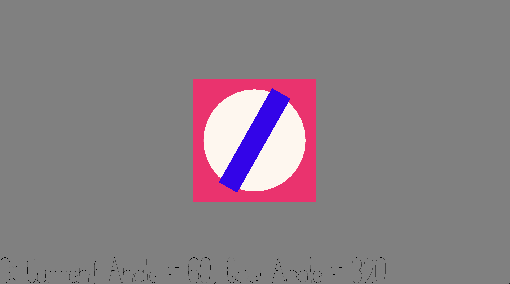

# Angle Matcher

Author: Ari Liloia

Design: 
In this game, you get a point every time you are able to turn a knob to a certain angle (displayed onscreen)
(This game started out as an attempt at implementing "picking" - Originally I wanted users to be able to click and drag the knob. I had trouble translating object coordinates to clip coordinates (this code is commented out) so at the last minute I changed the controls)

Screen Shot:

How To Play:

Use the "A" key to rotate the knob left, and "S" to rotate it right. 
The goal angle, current angle, and number of points are displayed on the bottom of the screen.
Every time the goal angle matches the current angle (while no keys are pressed), you get a point and a new goal angle. You have to "land" exactly on the goal angle after releasing your key press to get a point. 
Click and drag to change the camera position if you think it helps. Press "Escape" to regain mouse control.

This game was built with [NEST](NEST.md).
